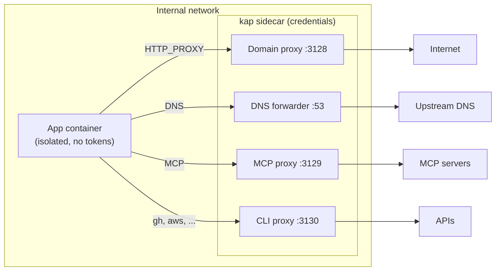

# kap

Run AI agents in secure capsules. Built on devcontainers with network controls and remote access.

- **Domain allowlist** - only approved domains are reachable from the container
- **MCP tool allowlist** - only approved tools are callable on remote MCP servers
- **CLI proxy** - `gh`, `aws`, etc. are proxied with per-command allowlists
- **Credential isolation** - tokens and API keys live on the sidecar and never enter the app container
- **Remote monitoring** - monitor and steer agents from your phone over local WiFi

> [!WARNING]
> This is experimental and may have bugs. Use at your own risk.

## Quick start

```bash
cargo install kap

cd your-project
kap init                          # scaffold .devcontainer/ with kap.toml
$EDITOR .devcontainer/kap.toml    # review allowed domains, MCP servers, CLI tools
kap up                            # start the sandboxed devcontainer
kap exec                          # shell into it
```

From inside the container, install and run Claude Code, Codex, or any AI agent. All network access is gated by the sidecar.

## Domain allowlist

`kap init` generates a `kap.toml` with a domain allowlist. Defaults cover common package managers, registries, and AI providers.

```toml
[proxy.network]
allow = [
  "github.com",
  "*.github.com",
  "crates.io",
  "*.crates.io",
  "*.ubuntu.com",
]
# deny overrides allow:
deny = ["gist.github.com"]
```

Wildcards (`*.github.com`) match subdomains but not the bare domain. Deny rules always win.

## MCP proxy

The MCP proxy sits between the agent and remote MCP servers, injecting credentials when forwarding upstream. The app container never sees tokens or API keys.

Register servers on the host:

```bash
# OAuth (opens browser)
kap mcp add linear https://mcp.linear.app

# API key via headers
kap mcp add context7 https://mcp.context7.com/mcp --header "CONTEXT7_API_KEY=sk-..."

kap mcp list          # see registered servers
kap mcp get linear    # show details + tools list
```

Then add each server to `kap.toml` with an `allow_tools` list:

```toml
[mcp]

# Allow all tools
[[mcp.servers]]
name = "context7"
allow_tools = ["*"]

# Allow only read/search operations
[[mcp.servers]]
name = "github"
allow_tools = ["get_*", "list_*", "search_*"]
```

Wildcards work the same as domain patterns (`get_*` matches `get_issue`, `get_user`, etc.).

## CLI proxy

The CLI proxy lets the app container run tools like `gh` or `aws` without direct access to credentials.

```toml
[cli]

[[cli.tools]]
name = "gh"
allow = ["pr *", "issue *", "repo *", "search *", "auth status"]
env = ["GH_TOKEN"]

[[cli.tools]]
name = "aws"
allow = ["s3 ls *", "s3 cp *", "sts get-caller-identity"]
env = ["AWS_ACCESS_KEY_ID", "AWS_SECRET_ACCESS_KEY"]
```

`deny` overrides `allow`. Tools must be installed on the sidecar (`gh` is included by default; add others via `[compose] build`).

## Remote access

Monitor and steer AI agents running in devcontainers from your phone over local WiFi.

```bash
kap remote start    # starts HTTP daemon on :19420, shows QR code
```

Scan the QR code on your phone to open the web UI. It auto-pairs and gives you:

- **Status** -container state, proxy health, denied request count
- **Logs** -live streaming proxy events, filterable by denied-only
- **Agent** -Claude Code session timelines, tool calls, cancel button, follow-up prompts

The daemon runs on the host. All API endpoints require a bearer token issued during QR pairing.

## How it works

`kap up` starts two containers on an internal Docker network: your app container (isolated, no internet) and a kap sidecar (controls all outbound access). The sidecar pulls from `ghcr.io/6/kap:latest` by default, or set `[compose] build` in `kap.toml` to build from source.



- The app container has **no external network route**. All traffic goes through the sidecar.
- DNS queries only resolve allowed domains. Disallowed domains get NXDOMAIN.
- Blocked requests get a 403 (domains) or JSON-RPC error (MCP tools).
- **Credentials never enter the app container.**

## Security model

Network isolation is **kernel-enforced**, not proxy-based. The Docker `internal: true` network has no default gateway, so the app container has no IP route to the outside world. Unsetting `HTTP_PROXY` or making direct TCP connections doesn't bypass it. The only reachable host is the sidecar.

MCP server domains are intentionally **not** in the domain allowlist. The agent can only reach them through the MCP proxy, which enforces tool filtering.

**Known limitations:**

- **Domain fronting (partial)**: kap validates that the TLS SNI in the tunnel matches the CONNECT domain, blocking SNI-mismatch attacks. Classic domain fronting (where SNI matches but the encrypted HTTP Host header differs) is not detected — this requires TLS interception, which kap intentionally avoids. Most major CDNs have disabled domain fronting.
- **Container escape**: a kernel exploit that breaks out of the container bypasses all isolation. Not specific to kap. Running Docker inside a VM (e.g., Docker Desktop, Firecracker) adds defense-in-depth.
- **No TLS inspection**: kap controls which domains are reachable, not what happens on them. It does not MITM HTTPS traffic. Once a domain is allowed, the agent has full access to that domain's API.

## Commands

| Command | Purpose |
|---------|---------|
| `kap init` | Scaffold kap into a project |
| `kap up` | Start the devcontainer |
| `kap down` | Stop and remove the devcontainer |
| `kap exec [cmd]` | Run a command in the devcontainer (default: shell) |
| `kap list` | List running devcontainers |
| `kap status` | Check if everything is wired correctly |
| `kap why-denied` | Show denied requests from the proxy log |
| `kap mcp add <name> <url>` | Register an MCP server (OAuth or API key) |
| `kap mcp get <name>` | Show server details and tools list |
| `kap mcp list` | List registered servers |
| `kap mcp remove <name>` | Remove a registered server |
| `kap remote start` | Start the remote access daemon (shows QR code) |
| `kap remote stop` | Stop the remote access daemon |
| `kap remote status` | Show daemon status and paired devices |
| `kap remote revoke <id>` | Revoke a paired device |

## Development

```bash
cargo check          # fast compile check
cargo build          # full build
cargo test           # run all tests
cargo clippy         # lint
```

This repo dogfoods kap via its own `.devcontainer/`. Open in VS Code or run:

```bash
kap up
kap exec .devcontainer/smoke-test.sh
```
